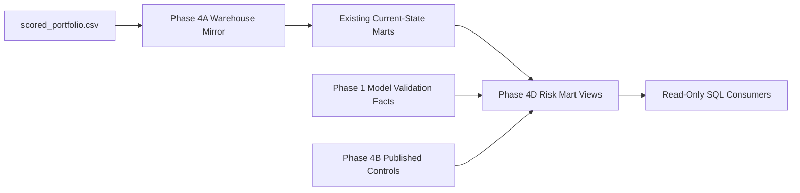

# KRONOS Enterprise Risk Marts Architecture

## Purpose

Phase 4D adds a governed SQL-consumption layer over the existing current-state
risk warehouse. The five views are additive and do not replace Phase 4A marts,
Phase 4B controls, or Phase 4C analytics.

## Architecture

## Objects

- `mart.vw_concentration_risk_current`
- `mart.vw_portfolio_quality_current`
- `mart.vw_watchlist_intelligence_current`
- `mart.vw_model_governance_current`
- `mart.vw_enterprise_risk_summary_current`

All objects are views. Phase 4D creates no schemas, base tables, facts,
dimensions, ETL jobs, or application dependencies.

## Deployment

`run_phase4d()`:

1. Copies the current DuckDB file to a temporary working database.
2. Creates or replaces only the five Phase 4D-owned views.
3. Runs 26 validation checks.
4. Runs 19 independent reconciliations.
5. Builds an independent lineage manifest.
6. Confirms existing schema, table, and mart contracts.
7. Publishes the verified working database.

Any failure returns `MARTS_UNAVAILABLE`. The working database is discarded and
the production database is not published.

## Dependency Isolation

Phase 4D is not imported by:

- `app/`,
- scoring or training code,
- provisioning or EWS engines,
- stress or contagion engines,
- Phase 4B scheduling,
- Phase 4C SAS-Style Analytics.

Application startup therefore remains independent of Phase 4D availability.

## Control Isolation

The views may read current Phase 4B control data but never write it.

Phase 4D does not modify:

- `control.reconciliation_result`,
- `control.publish_status`,
- `control.etl_quality_summary`,
- `control.lineage_node`,
- `control.lineage_edge`,
- `control.column_lineage`.

The enterprise view reads `control.reconciliation_result` directly so it can
aggregate all reconciliation controls for the selected published batch. The
latest-control convenience views use explicit column projections and are
recreated after control-schema migrations.

## Temporal Boundary

The source has one scoring run and one process timestamp. The views make no
claim of origination, observation, vintage, reporting, migration, cure,
recovery, or historical stage information.

The only credit-loss aggregate is `current_credit_loss_proxy`, defined as
`PD * LGD * EAD`.
