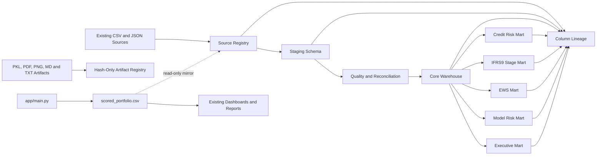
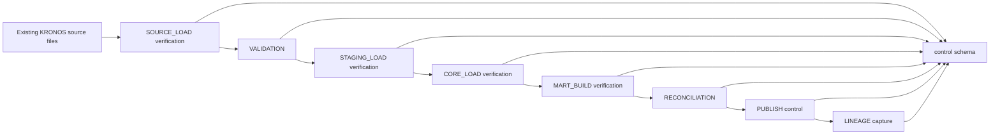

# KRONOS Enterprise Risk Warehouse Architecture

## Purpose

Phase 4A provides a governed analytical mirror of existing KRONOS artifacts. It preserves all current CSV workflows and does not change scoring, dashboards, models, risk engines, validation, or reporting.

## Architecture



## Technology

- Database: DuckDB 1.4.3
- Database path: `data/warehouse/kronos_risk.duckdb`
- SQL schemas: `control`, `staging`, `reference`, `core`, `mart`
- Source-of-truth policy: existing CSV artifacts

## Isolation

No existing application module imports `src.enterprise_data`. Warehouse failure therefore cannot interrupt application startup.

The database is built in a local temporary directory and copied to the synchronized workspace only after the connection closes. This prevents DuckDB WAL checkpoint failures caused by workspace child-file deletion restrictions.

## Data Layers

### Control

Tracks:

- ETL batches and steps
- Source files and hashes
- Artifact metadata
- Source schemas
- Quality checks
- Reconciliations
- Rejected records
- Lineage nodes, edges, and columns

### Staging

CSV tables mirror source values and add only:

- `etl_batch_id`
- `source_asset_id`
- `source_sha256`
- `loaded_at`

JSON artifacts are preserved as JSON payload text with their source hash.

### Core

The core credit fact is append-only and keyed by source hash, borrower, run, and model version. Repeated identical files do not create duplicate business facts.

The facility dimension does not contain a fabricated account ID. It uses a technical warehouse key derived directly from the current borrower row, stores `source_account_id` as null, and sets `account_proxy_flag` to true.

### Marts

Phase 4A marts expose current persisted information only. They do not execute IFRS9, EWS, stress, contagion, or decision engines and do not claim to contain their transient runtime outputs.

## Model-Version Integrity

The scored portfolio contains model version `51a7373f45ff8b6f`. The active model artifacts currently produce a different composite hash. The warehouse records:

```text
UNRESOLVED_CURRENT_ARTIFACTS_DIFFER
```

No false association is created between the historical scoring run and current model files.

## Temporal Integrity

The only borrower-level timestamp is scoring execution time. It is not an observation, reporting, origination, default, or vintage date.

Historical migrations, roll rates, and vintage analysis remain unavailable until genuine repeated observations and source dates exist.

## Phase 4B ETL Control Plane

Phase 4B adds a DataStage-style operational control plane without changing the
Phase 4A physical warehouse design.



The Phase 4B jobs do not reload source rows, rebuild core tables, or recreate
marts. They validate that the existing read-only mirror matches its registered
source hashes and row-count contracts.

Operational services are implemented under `src/enterprise_data/etl/`:

- batch and job control,
- dependency validation and topological execution,
- enterprise data-quality rules,
- reject metadata logging,
- publish lifecycle controls,
- operational metrics,
- restart-safe recovery,
- job and batch lineage.

Downstream jobs are marked `BLOCKED` when an upstream dependency fails. A
recovery creates a new linked batch, skips previously successful jobs, and
resumes the failed and downstream steps without duplicating warehouse facts.
