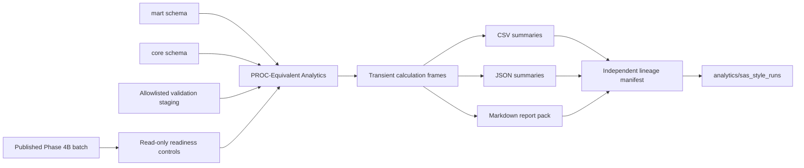

# KRONOS SAS-Style Analytics Architecture

## Purpose

Phase 4C provides read-only PROC-Equivalent Analytics over the Phase 4A
warehouse and Phase 4B control framework.

It does not execute SAS software, PROC SQL, or a SAS runtime.

## Architecture



## Isolation

- Every DuckDB connection uses `read_only=True`.
- Phase 4C is not imported by `app/`.
- Phase 4C is not part of the Phase 4B job graph.
- No database object is created, altered, replaced, or dropped.
- Failure returns `ANALYTICS_UNAVAILABLE`.
- Deleting the Phase 4C package does not affect KRONOS startup.

## Source Hierarchy

### Primary

- `mart.mart_credit_risk_current`
- `mart.mart_ifrs9_stage_current`
- `mart.mart_ews_current`
- `mart.mart_model_risk`
- `mart.mart_executive_current`
- `mart.mart_data_quality`

### Secondary

- `core.dim_borrower`
- `core.dim_credit_facility`
- `core.dim_model`
- `core.dim_model_artifact`
- `core.fact_model_performance`
- `core.fact_model_validation`
- `core.fact_feature_importance`

### Allowlisted staging

- `staging.stg_calibration_decile`
- `staging.stg_challenger_comparison`
- `staging.stg_challenger_performance`
- `staging.stg_oot_summary`
- `staging.stg_oot_risk_band_shift`
- `staging.stg_oot_score_shift`

General credit staging tables are not part of the analytical source catalog.

## PROC-Equivalent Modules

- `proc_freq.py`: categorical distributions
- `proc_means.py`: descriptive statistics and quantiles
- `proc_summary.py`: grouped portfolio measures
- `proc_tabulate.py`: dense multidimensional cross-tabs
- `proc_report.py`: institutional report frames and Markdown
- `proc_rank.py`: deterministic decile summaries
- `proc_transpose.py`: reporting pivots

## Banking Analytics

- portfolio segmentation,
- concentration and HHI,
- watchlist reporting,
- top-exposure reporting,
- current credit loss proxy,
- IFRS 9 stage composition,
- model inventory and performance,
- calibration, PSI, challenger and proxy-OOT summaries.

The current credit loss proxy is `PD * LGD * EAD`. It is not IFRS 9 ECL, a
provision, or an accounting reserve.

## Temporal Boundary

The borrower portfolio contains one current scoring snapshot. Phase 4C
therefore blocks:

- vintage analytics,
- migration and roll-rate analytics,
- default cohorts,
- recovery and cure analytics,
- historical trends,
- observation-period and reporting-period analytics,
- historical stage movements,
- lifetime ECL analytics.

These requests return `TEMPORAL_HISTORY_NOT_AVAILABLE`.

## Output Architecture

Outputs are written only to:

```text
analytics/sas_style_runs/<analytics_run_id>/
```

Each run contains:

- CSV summaries,
- JSON summaries,
- institutional Markdown report pack,
- `lineage_manifest.json`,
- `hash_inventory.json`,
- `manifest.json`.

Borrower-level ranks, warehouse extracts, intermediate joins, and temporary
calculation frames are not persisted.
